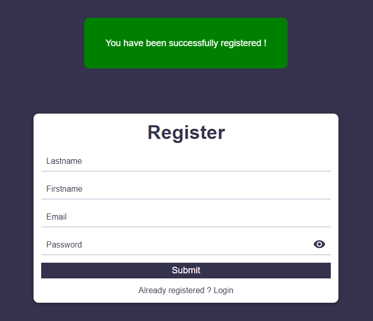
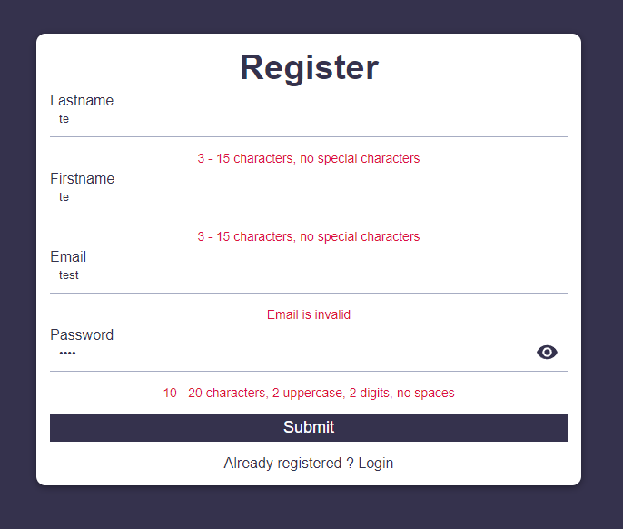

# Système d'authentification | React, Node.js, MongoDB






## Installation :

Installer les dépendances dans chacuns des deux dossiers avec la commande `npm install`.

## Client :

A la racine du dossier `client` :\
Créer un fichier `.env`

```terminal
REACT_APP_BASE_URL = 'http://localhost:8080'
```

Démarrer ensuite le serveur avec la commande `npm start`.

## Api :

A la racine du dossier API:\
Créer un fichier `.env` en précisant la valeur de chaque variable comme suit :

```
PORT = '<Port utilisé>'
USER_DB = '<Nom d'utilisateur MongoDB>'
PASSWORD_DB = '<Mot de passe associé au nom d'utilisateur>'
NAME_DB = '<Nom du cluster MongoDB>'

SECRET_KEY = 'Clé secréte jwt'
```

Démarrer ensuite le serveur avec la commande `node server` ou `nodemon server` si ce paquet est installé sur votre machine.

## Tester le projet :

```terminal
git clone https://github.com/Cyril-Develop/Authentication-System.git
```
